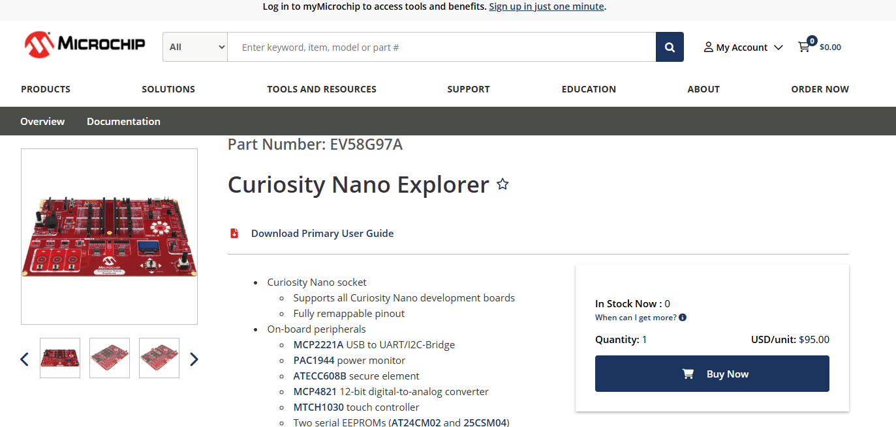
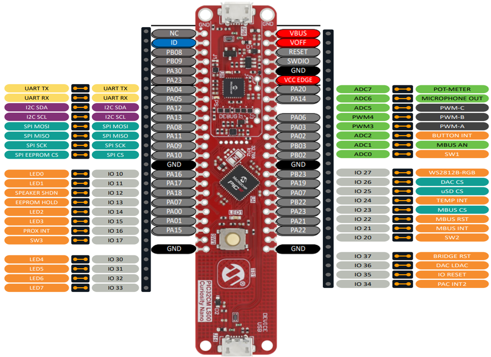

# EEE 158: Curiosity Nano Explorer Board

[Microchip Curiosity Nano Explorer Product Page](<https://www.microchip.com/en-us/development-tool/EV58G97A>)

- [Pin Mapping to other Curiosity Nano Boards](<https://ww1.microchip.com/downloads/aemDocuments/documents/MCU08/ProductDocuments/BoardDesignFiles/Curiosity-Nano-Explorer-Pinouts.pdf>)

  - As of 12/09/2024, Mapping for Curiosity Nano PIC32CM LS00 is not yet available officially. We may instead refer to the image below

